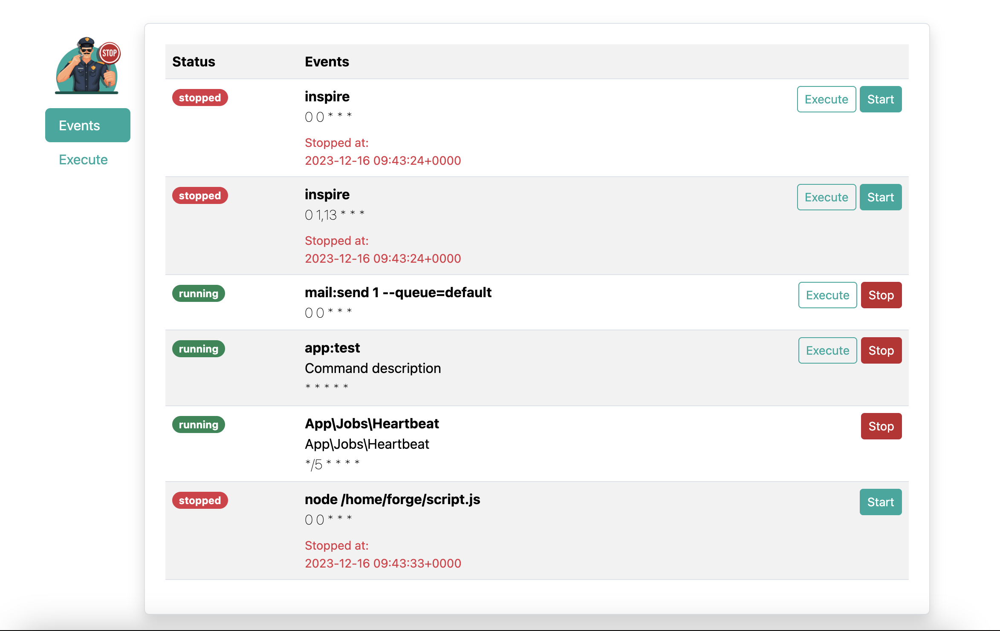
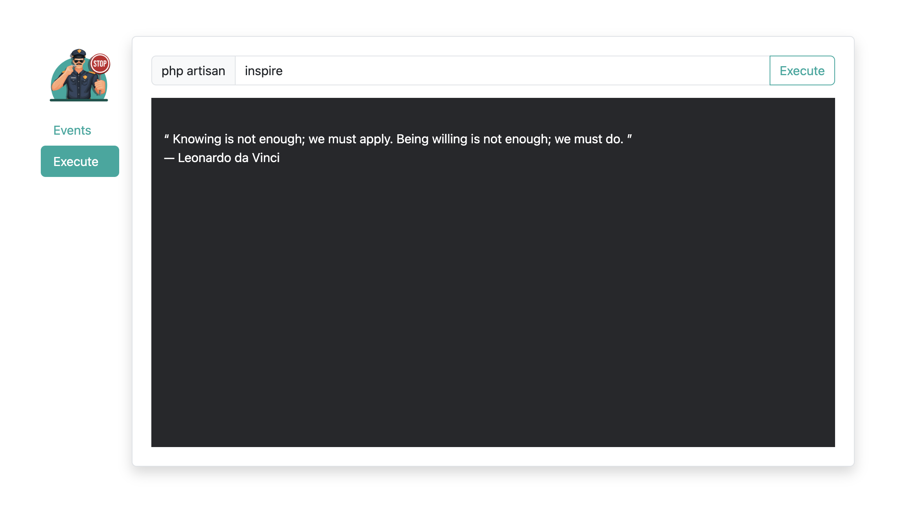

# Laravel Schedule Police
[](https://packagist.org/packages/acdphp/laravel-schedule-police)

Use this if you need to:
- :white_check_mark: Stop and start scheduled commands without redeploying.
- :white_check_mark: Execute commands without going into server console.
- :white_check_mark: Keep the visibility, control, and reviewability of the schedule configurations in your codebase.

### Compatibility Matrix

| <span align="left">Laravel</span> | <span align="left">Schedule Police</span> |
|:----------------------------------|------------------------------------------:|
| 11.x                              |                                       2.x |
| 8.x ~ 10.x                        |                                       1.x |

## Installation
1. Install the package
    ```shell
    composer require acdphp/laravel-schedule-police
    ```

2. Run the migration.
    ```shell
    php artisan migrate
    ```
   
3. Publish assets
   ```shell
   php artisan vendor:publish --tag=schedule-police-assets --force
   ```
   
## Config
You may override the config by publishing it.
```shell
php artisan vendor:publish --tag=schedule-police-config
```

You may also just define environment variables if you don't need to publish the config.
- Disable command execution in the dashboard.
```dotenv
SCHEDULE_POLICE_ALLOW_EXECUTE_CMD=false
```

- Add prefix to routes.
```dotenv
SCHEDULE_POLICE_URL_PREFIX=your-prefix
```

## Dashboard
After installation, you may access the dashboard via the `/schedule-police` route.

### Authorization
By default, you will only be able to access this dashboard in the local environment. However, you may specify authorization for non-local environments by defining `viewSchedulePolice` gate, typically within the `boot` method of the `App\Providers\AuthServiceProvider` class.

```php
public function boot(): void
{
    Gate::define('viewSchedulePolice', function (User $user) {
        // return true or false
    });
}
```

## Screenshots
### Events list page


### Execute page


## License
The MIT License (MIT). Please see [License File](LICENSE) for more information.
